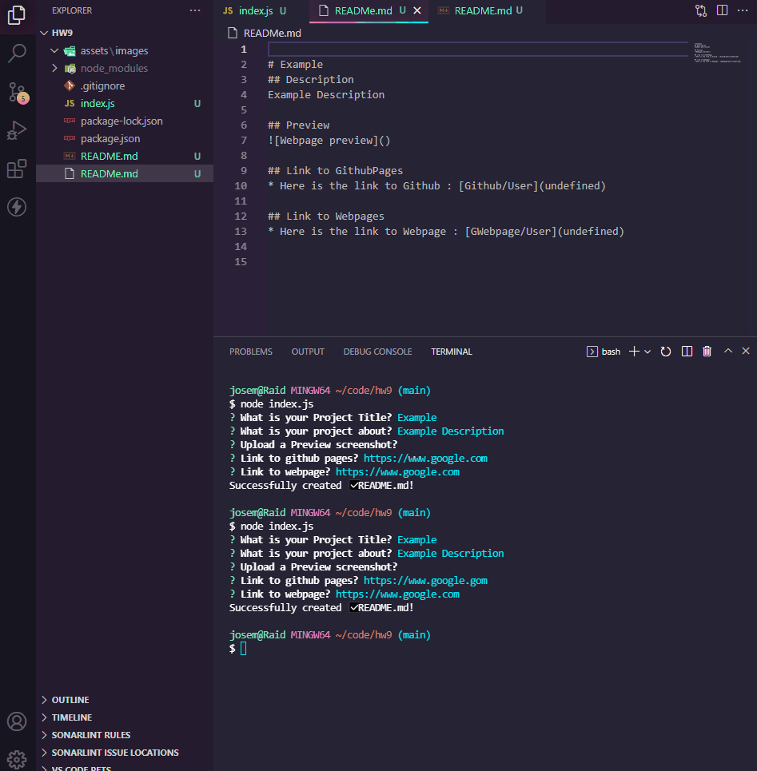

# Readme Generator

## Description

This repo/code has the ability for the user to generate a README.md file. "node 'file name'" would need to be typed in the integrated terminal. User will then be asked for the basics of the README.md file. Such as the "title", "description", a "preview" image or gif of the webpage, and two different "links", one for the User's Github and their Webpage created. 

## Preview

## Link to Dashboard

* Here is the link to my github : [Github/JMGuzman-784](https://github.com/JMGuzman-784/hw9)

* Here is the code : [JMGuzman-784/Readme-Gen](https://github.com/JMGuzman-784/hw9/blob/main/index.js)
